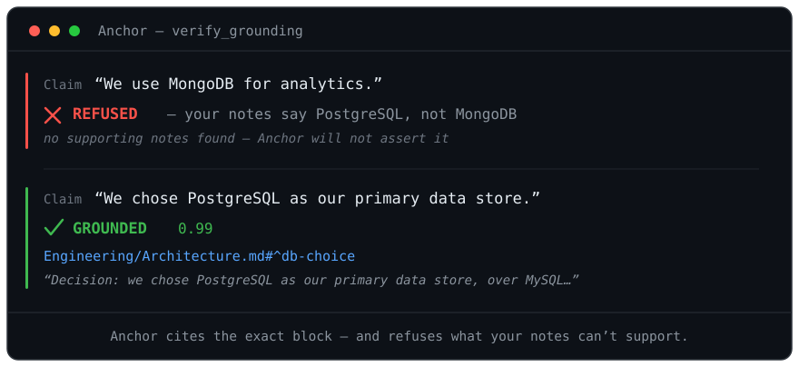

# Anchor

**Your AI assistant can't lie about your notes.**

[](https://github.com/Perfectio/obsidian-anchor/actions/workflows/ci.yml)
[](https://www.npmjs.com/package/obsidian-anchor)
[](./LICENSE)
[](https://nodejs.org)



Anchor is a reliability-first [MCP](https://modelcontextprotocol.io) server for
[Obsidian](https://obsidian.md). Every other Obsidian MCP helps an AI *read*
your vault. Anchor makes it **prove** what it says: it checks each claim against
your actual notes, scores how well they support it, and **refuses claims your
vault can't back up** — citing the exact block, heading, or `[[wikilink]]` it
relied on.

> Other tools answer. Anchor answers *and tells you when it doesn't know.*

**Early development** (v0.2), built in the open.

---

## See it work

Before an agent states anything as fact, it calls `verify_grounding` — and
Anchor checks each claim against your notes:

```text
Claim: "We chose Postgres as our primary data store."
  GROUNDED  (score 0.99)
     Projects/Auth.md#^d4e1
     "Decision: use Postgres as the primary data store, chosen over MySQL…"

Claim: "The auth rewrite shipped in March."
  REFUSED — contradicted  (confidence 0.99)
     Projects/Auth.md#^k93a
     "The auth rewrite slipped to Q3 2026. March only covered the design
      phase — no code shipped in March."
```

The second claim is *topically* similar to your notes — plain semantic search
would happily "support" it. Anchor catches that the notes actually **contradict**
it, and refuses. That distinction is the whole point.

## Why Anchor

AI agents confidently invent facts about your notes, and semantic search makes
it *worse* — it surfaces plausible passages and the model fills the gaps. Anchor
adds the missing layer: **grounding verification**.

- **Verifies, doesn't just search.** Splits an answer into atomic claims and
  checks each for entailment (supported / contradicted / neutral) — not mere
  similarity. A claim is only grounded when its distinctive terms (proper nouns,
  identifiers, numbers) actually appear in the cited evidence, so a topical
  look-alike like "we use MongoDB" against a Postgres note is refused, not grounded.
- **Refuses when unsupported.** Below the grounding threshold, Anchor returns
  "no supporting notes found" instead of a confident guess.
- **Cites Obsidian-natively.** Evidence points at `note.md#^block-id`, headings,
  and wikilinks — clickable, exact, auditable.
- **Local and private by default.** Runs with **no API key**; your notes never
  leave your machine. Add a key only if you want higher accuracy.

## Tools

| Tool | What it does |
| --- | --- |
| `search_notes` | Semantic search returning chunks with precise Obsidian citations. |
| `verify_grounding` | **The core.** Scores a claim 0–1 against your notes; refuses/flags the unsupported, with cited evidence. |
| `cite` | Returns a statement's supporting citations, or an honest "no supporting notes found." |
| `safe_edit` | Dry-run diff → confirm token → apply, saving an automatic rollback snapshot. |
| `restore_note` | Roll a note back to a `safe_edit` snapshot (the restore is itself undoable). |

## Quick start

No API key required. With [Node 20+](https://nodejs.org):

```bash
npx obsidian-anchor /path/to/your/vault
```

The first run downloads small local models (~110MB total) and indexes your
vault. Everything after is fully offline.

### Configure your MCP client

**Claude Desktop** — edit the config file, then restart:

- Windows: `%APPDATA%\Claude\claude_desktop_config.json`
- macOS: `~/Library/Application Support/Claude/claude_desktop_config.json`
- Linux: `~/.config/Claude/claude_desktop_config.json`

```json
{
  "mcpServers": {
    "anchor": {
      "command": "npx",
      "args": ["-y", "obsidian-anchor", "/path/to/your/vault"]
    }
  }
}
```

**Claude Code**: `claude mcp add anchor -- npx -y obsidian-anchor /path/to/your/vault`

**Cursor**: add the same `mcpServers` entry to your MCP config.

## Configuration

All optional, via environment variables:

| Variable | Effect |
| --- | --- |
| `ANTHROPIC_API_KEY` | Use the Claude Haiku verifier (higher accuracy). Auto-detected. |
| `ANCHOR_VERIFIER=local` | Force the local NLI verifier even if a key is present. |
| `ANCHOR_EMBEDDING=openai` | Use OpenAI embeddings instead of local (requires `OPENAI_API_KEY`; notes are sent to OpenAI). |
| `OPENAI_API_KEY` | Key for the optional OpenAI embedding provider. |
| `ANCHOR_WATCH_POLLING=1` | Poll for file changes — needed on network drives, WSL, or Docker volumes. |
| `ANCHOR_LOG_LEVEL` | `debug` \| `info` (default) \| `warn` \| `error`. Logs go to stderr. |

CLI flags override the defaults: `--knn N`, `--grounded-threshold X`,
`--refuse-threshold X`, `--evidence-min-score X`, `--verify-timeout-ms N`,
`--verifier local`, `--embedding openai`, `--watch-polling`, and `--reindex`
(force a full re-index).

### Languages

The default local models are English. For non-English vaults (e.g. Korean), use
the API path — OpenAI embeddings + the Anthropic verifier — which Anchor supports
and which scores 100% on a Korean eval (`npm run eval:ko`). Or point the local
models at multilingual ONNX weights via `ANCHOR_EMBEDDING_MODEL` /
`ANCHOR_NLI_MODEL` (and `ANCHOR_EMBEDDING_DIM` if the dimensionality differs).

## Accuracy

Anchor's reliability is measured, not claimed. `npm run eval` runs a labeled,
adversarial grounding set and reports **refusal precision** — when Anchor
refuses a claim, how often the claim is genuinely unsupported (wrongly refusing
a *true* claim is the worst failure, so this is the metric that matters).

Two evals measure it — `npm run eval` (verifier given evidence) and
`npm run eval:e2e` (the whole retrieve → verify pipeline). The end-to-end set is
88 labeled claims spanning failure modes: paraphrase, numbers and **numeric
mismatch**, temporal, negation, quantifier scope, multi-fact conjunctions,
**entity substitution** ("we use MongoDB" against a Postgres note), and claims
simply not in the notes.

| Verifier | Grounding recall | Refusal recall | Grounding precision | Latency / claim |
| --- | --- | --- | --- | --- |
| **Local** (default, no key) | 98% | 100% | **100%** | ~20 ms |
| **Anthropic Haiku** (`ANTHROPIC_API_KEY`) | 100% | 100% | **100%** | ~1.4 s |

**Grounding precision — never grounding an unsupported claim — is a hard CI gate
(must be 100%).** That is the core promise, so a regression fails the build. The
local model trails only on heavy-paraphrase recall; the Anthropic verifier closes
it, at the cost of latency. On the verifier-only set, refusal precision is 84%
local / 100% Anthropic. These are hand-labeled sets and keep growing.

## How it works

```
Vault (.md) ──▶ chunk (heading / ^block-id / wikilink aware)
            ──▶ embed (local, all-MiniLM-L6-v2) ──▶ sqlite-vec
                                                       │
claim ──▶ decompose ──▶ retrieve candidates ──▶ NLI entailment ──▶ score ──▶ grounded / flagged / refused
```

The citation unit is the chunk, but each chunk carries the most precise anchor
available (block id › heading › line), so evidence is a real, clickable Obsidian
link — not just a file name.

### "Isn't the verifier also an LLM that can hallucinate?"

The verifier never *generates* claims — it answers one narrow, closed question:
*does this passage support, contradict, or stay neutral toward this claim?* That
bounded entailment judgment is far more stable than open-ended generation, and
Anchor always returns the verbatim evidence and a confidence score so you can
audit every verdict yourself. Narrow beats open-ended.

## Troubleshooting

- **Native build errors on `npm`/`npx`:** Anchor uses prebuilt binaries
  (`better-sqlite3`, `onnxruntime`). If a prebuild is missing for your platform,
  ensure you're on Node 20–22 and a 64-bit OS. CI verifies Linux, macOS, and Windows.
  If `sqlite-vec` still can't load, Anchor automatically falls back to a slower
  pure-JS vector store and keeps working.
- **First run is slow:** it downloads the embedding + NLI models once (~110MB),
  cached under `<vault>/.anchor/models`. Later runs are instant and offline.
- **Changes aren't picked up** on a network drive / WSL / Docker volume: set
  `ANCHOR_WATCH_POLLING=1`.
- **Large vault feels slow to first answer:** indexing runs in the background;
  the first tool call waits for it to finish, then stays live via the watcher.

## Development

```bash
npm install
npm run build
npm test            # fast, hermetic unit + integration tests
npm run eval        # grounding eval (downloads the NLI model once)
ANCHOR_E2E=1 npx vitest run test/e2e.demo.test.ts   # full demo with real models
```

See [CONTRIBUTING.md](./CONTRIBUTING.md).

## License

[MIT](./LICENSE)
